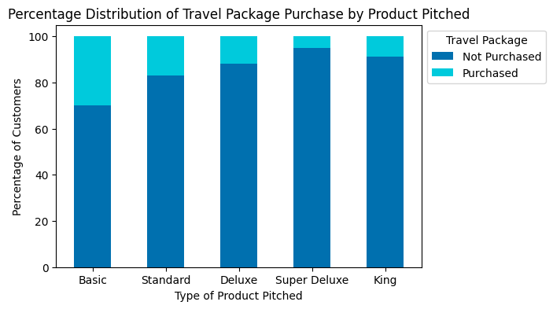
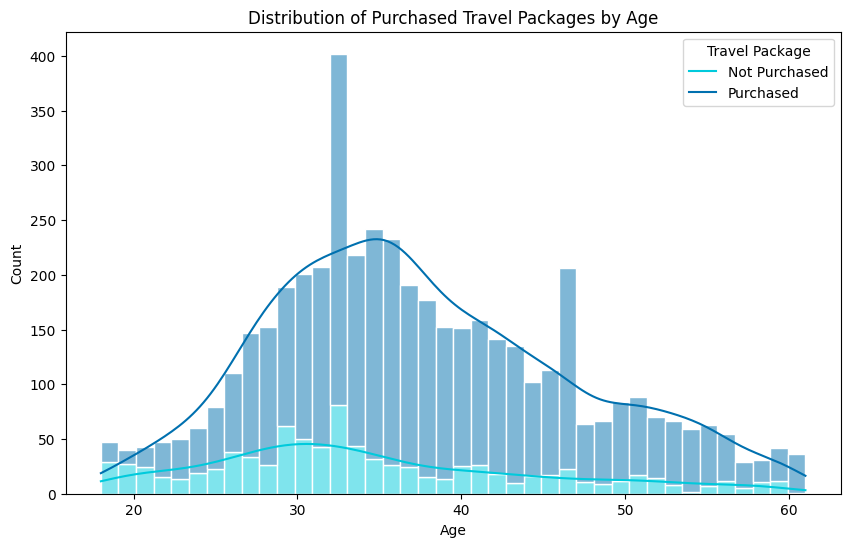
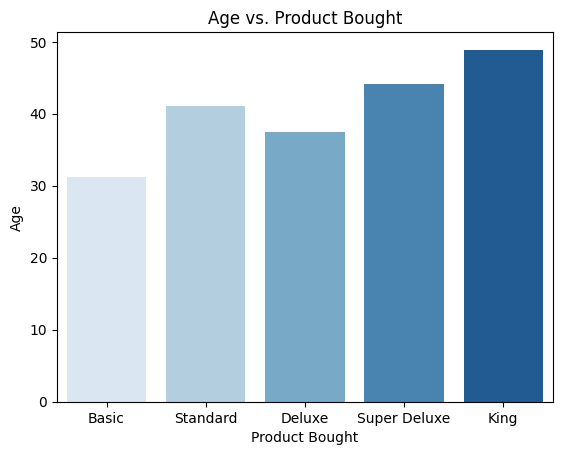
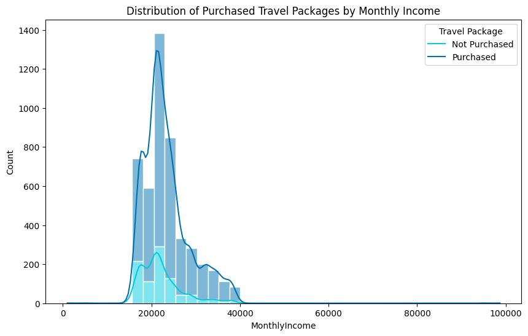
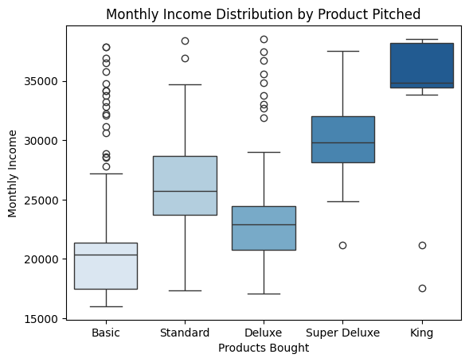
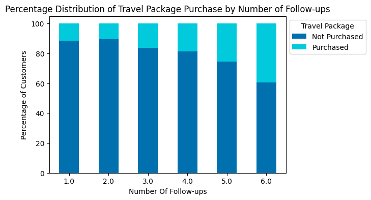

# Travel Package Prediction 💎

(This project is submitted as the final requirement for the Data Science Bootcamp at Dibimbing.ID.)                                                                                                                                                                                                                                                                                                                                                                                                                                                                                                                                                                               

## Project Background

Travel packages, which combine transportation, accommodation, and sometimes activities or tours, are increasingly popular among customers seeking convenience, cost savings, and curated experiences. Customers often purchase these packages to simplify travel planning, access exclusive deals, or ensure a seamless vacation experience. However, not everyone feels compelled to buy them. In the competitive travel and tourism industry, understanding the factors driving package purchases is crucial for businesses aiming to optimize their offerings and marketing strategies.

This project focuses on analyzing a travel package prediction dataset to uncover patterns in customer behavior and predict package purchases. By identifying the key drivers behind customer decisions, travel agencies can design targeted marketing campaigns, personalize recommendations, and enhance customer satisfaction. The insights gained will ultimately benefit businesses by increasing revenue, improving resource allocation, and fostering customer loyalty while enabling travelers to enjoy more tailored and value-driven experiences.

## Problem Statement

Travel agencies can often struggle to figure out which customers will buy their travel packages, which causes them to spend their resources marketing to everyone rather than focusing on just the right audience. This can lead to inefficient budget, missed revenue opportunities, and poor customer experiences. This project aims to identify factors influencing travel package purchases. The model precision, recall, F1-score, and ROC-AUC metrics impact on the marketing efficiency can then be used to measure the success of the project.

## Goals

- To determine customer profile and analyze their purchasing behaviour.
- To develop a prediction model that can predict the likelihood of customers purchasing a travel package.

## Objective

To develop a prediction model to predict the probability of travel package purchase based on each customer profile.

## Dataset

The dataset used for this project can be found on Kaggle: [Travel Package Dataset](https://www.kaggle.com/datasets/sanamps/tourpackageprediction)

## Data Dictionary

- **CustomerID:** Unique customer ID
- **Age:** Age of customer
- **TypeofContact:** How customer was contacted - Company Invited ot Self Inquiry
- **CityTier:** The development of a city (population, facilities, living standards, etc.) - Tier 1 > Tier 2 > Tier 3
- **DurationofPitch:** Duration of pitch by a salesperson to the customer
- **Occupation:** Occupation of customer
- **Gender:** Gender of customer
- **NumberofPersonVisiting:** Total number of persons planning to take the trip with the customer
- **NumberofFollowups:** Total number of follow-ups has been done by the salesperson after the sales pitch
- **ProductPitched:** Product pitched by the salesperson - Basic, Standard, Deluxe, Super Deluxe, King
- **PreferredPropertyStar:** Preferred hotel property rating by customer
- **MaritalStatus:** Marital status of customer
- **NumberofTrips:** Average number of trips taken in a year by customer
- **Passport:** Whether the has a passport or not  - 0: No, 1: Yes
- **PitchSatisfactionScore:** Sales pitch satisfaction score
- **OwnCar:** Whether the customers own a car or not - 0: No, 1: Yes
- **NumberofChildrenVisiting:** Total number of children with age less than 5 planning to take the trip with the customer
- **Designation:** Designation of the customer in the current organization
- **MonthlyIncome:** Gross monthly income of the customer

## Target

- **ProdTaken:** Whether the customer took the product or not

## Exploratory Data Analysis

### Proportion of Purchased Travel Packages 

**Insight**: The percentage of people purchasing the product (18.8%) is less than those who do not (81.2%). Therefore, key factors driving purchase behaviour need to be identified, and a more targeted marketing approach needs to be implemented.

### Factors Influencing Customer Purchasing Behaviour

#### Percentage Distribution of Travel Package Purchased by Product Pitched

**Insights**:

- More customers purchased the travel package when pitched the basic product, compared to the Super Deluxe and King options.
- The basic package resonates more with the majority of customers, potentially due to its perceived affordability and suitability for a wider audience.

#### Customer Age Insights

**Insights:**

- Most purchases occur between 25–40 years, peaking around 30 years.
- Product preference shifts with age. Higher-tier packages appeal to older customers, while younger customers favor budget-friendly options.

#### Consumer Income Insights

**Insights:**

- Income distribution is concentrated between $15,000–30,000, peaking at $20,000–25,000.
- Higher-tier products align with higher income. Product preferences correlate with income, supporting segmentation by purchasing power.

#### Percentage Distribution of Travel Package Purchased by Number of Follow-ups

**Insights**:

- Customers with a higher number of follow-ups were more likely to purchase a travel package. 
- Increased engagement from the sales team positively impacts customer decisions, indicating that persistent follow-up efforts may play a significant role in converting potential leads into actual buyers.

### Customer Profile by Travel Package

| **Package**     | **Age Range**  | **Monthly Income**   | **Occupation**        | **Designation**     | **City Tier**   |
| **Basic**       | 20-30          | <20,000              | Free lancers/Salaried | Executives          | 3               |
| **Standard**    | 31-40          | 25,000 - 30,000      | Small Business Owners | Managers            | 3               |
| **Deluxe**      | 31-40          | 20,000 - 25,000      | Small Business Owners | Senior Managers     | 3               |
| **Super Deluxe**| 41-50          | 30,000 - 35,000      | Salaried              | AVPs                | 3               |
| **Basic**       | 51+            | 35,000 - 40,000      | Small Business Owners | VP                  | 1               |

## Data Pre-Processing

1. Data Wrangling involved data cleaning such as fixing data quality (types, duplicates, and missing).
There were 2.8% duplicated data that were dropped and a few MAR data filled with Mice Imputation.
2. Feature Selection and Engineering involved:
- Encoding the categorical variables (`TypeofContact`, `Occupation`, `Gender`, `ProductPitched`, `MaritalStatus`, and `Designation`)
- Checking variables multicollinearity (`Designation` was dropped)
3. The data was then split into 80% train: 20% test ratio for modelling
4. Outliers were also removed from the train data set.

## Model Selection and Analysis

The base model Decision Tree showed a training F1-score of 100% and testing F1-score of 71.72%. 

The strongest performing model with good generalization is the XGBoost with a training F1-score of 99.84% and testing F1-score of 78.83%. A tuned XGBoost model (without SMOTE) showed further improvement over all metrics with a testing F1-score of 78.96%.

## Features Importances

1. **Product Pitched is Dominant:** The type of package offered significantly impacts customer purchasing decisions.
2. **City Tier**: The customer's demographic location affects their preferences.
3. **Number of Follow-ups:** Consistent engagement increases the likelihood of purchase.
4. **Other Demographic Factors:** Occupation provides insight into customer’s financial capacity and interests, impacting their likelihood to purchase specific packages. Since this was not prominent in EDA, it can be a step for improvement in further research.

## Key Takeaways

1. **Personalize Product Pitches by Customer Persona**  
   
- Tailor marketing efforts to emphasize Basic and Deluxe packages for customers in their 30s with income ranges of 20,000-40,000, focusing on executives, senior managers, and small business owners. 
- Use customer data to recommend packages most likely to match their profile.

2. **Focus on High-Conversion Tiers and Cities**  

- Prioritize marketing resources in City Tier 3for mid-tier packages (Standard, Deluxe) and City Tier 1 for higher-end packages (King). 
- Use different communication strategies based on customer city tier demographics.  
   
3. **Increase Follow-Up Efforts Strategically**  
  
- Design targeted follow-up campaigns for leads that show interest but have not converted yet, especially for high-value packages like Deluxe and King. 
- Ensure the sales team follows up with at least 3-4 interactions for better success rates.  

## Thank You 👍
