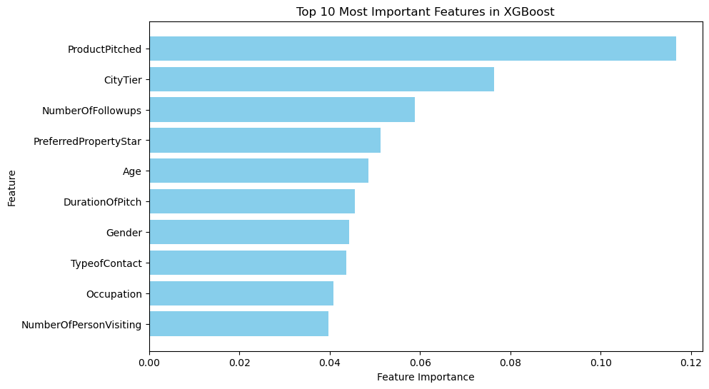

# Travel Package Prediction ✈️🏖

*(This project is submitted as the final requirement for the Data Science Bootcamp at Dibimbing.ID.)*

## 📌 Project Background

Travel packages, which combines transportation, accommodation, and sometimes guided activities, are increasingly popular among customers seeking convenience, savings, and curated experiences. However, not all customers choose to purchase these packages. In a highly competitive travel and tourism market, understanding what drives these purchasing decisions is essential for companies looking to improve their offerings and marketing efficiency.

This project analyzes a travel package prediction dataset to uncover customer behavior patterns and build a predictive model. By identifying key drivers of customer decisions, businesses can design targeted marketing campaigns, offer personalized recommendations, and enhance customer satisfaction — ultimately improving revenue and customer retention.

## 🧩 Problem Statement

Travel agencies often struggle to identify which customers are likely to purchase travel packages, leading to inefficient, broad-based marketing efforts. This results in wasted budget, missed sales opportunities, and suboptimal customer experiences. The goal of this project is to pinpoint the most influential factors affecting customer purchasing decisions. The model's performance — measured using F1-score and ROC-AUC — reflects its effectiveness in supporting smarter marketing strategies.

## 🎯 Project Goals

- Analyze customer profiles and their travel package purchasing behavior.
- Build a machine learning model to predict the likelihood of package purchase.

## 🎯 Objective

To develop a classification model that predicts the probability of a customer purchasing a travel package based on individual profile features.

## 📁 Dataset

Dataset Source: [Kaggle - Travel Package Dataset](https://www.kaggle.com/datasets/sanamps/tourpackageprediction)

## 📚 Data Dictionary

- `CustomerID`: Unique identifier for each customer
- `Age`: Age of the customer
- `TypeofContact`: Mode of contact — Company Invited or Self Inquiry
- `CityTier`: City development level — **1 = least urban, 3 = most urban**
- `DurationOfPitch`: Duration of the sales pitch (in minutes)
- `Occupation`: Customer's occupation
- `Gender`: Gender of the customer
- `NumberOfPersonVisiting`: Group size traveling with the customer
- `NumberOfFollowups`: Number of sales follow-ups
- `ProductPitched`: Package pitched — Basic, Standard, Deluxe, Super Deluxe, King
- `PreferredPropertyStar`: Preferred hotel star rating
- `MaritalStatus`: Marital status of the customer
- `NumberOfTrips`: Average number of trips per year
- `Passport`: 1 = Yes, 0 = No
- `PitchSatisfactionScore`: Satisfaction rating of the sales pitch
- `OwnCar`: 1 = Owns a car, 0 = Does not
- `NumberOfChildrenVisiting`: Children (under 5) accompanying the customer
- `Designation`: Job designation level
- `MonthlyIncome`: Customer's gross monthly income

**Target: `ProdTaken` — whether the customer purchased the travel package (1 = Yes, 0 = No)**

## 🔄 Data Preprocessing

1. **Data Cleaning:**  
   - Checked for and resolved data type mismatches and missing values.
   - No duplicates were found.
   - Missing data (MAR) was imputed using MICE Imputation.

2. **Feature Selection & Engineering:**  
   - Encoded categorical variables (`TypeofContact`, `Occupation`, `Gender`, `ProductPitched`, `MaritalStatus`, `Designation`)  
   - Dropped multicollinear features (e.g., `Designation`) based on correlation checks.

3. **Outlier Handling:**  
   - Removed outliers from continuous variables using the IQR method.

4. **Feature Scaling:**  
   - Applied `StandardScaler` to continuous variables such as `Age`, `MonthlyIncome`, and `DurationOfPitch` to normalize scales for distance-based models.

5. **Train-Test Split:**  
   - Split dataset into 80% training and 20% testing for model evaluation.

## 🤖 Model Selection & Evaluation

- **Baseline Model:**
  Logistic Regression
  - Train F1-score: 38.99%  
  - Test F1-score: 43.60%  

- **Best Performing Model:**  
  XGBoost (tuned, without SMOTE)  
  - Train F1-score: 100%  
  - Test F1-score: **81.21%**  
  - Best generalization performance across all metrics

## 🔍 Feature Importance Insights

Top predictive features (in ranked order):

1. **Product Pitched** – Customers respond most positively to Basic and Standard packages.
2. **City Tier** – Tier 3 customers are most likely to purchase.
3. **Number of Follow-ups** – More follow-ups increase the likelihood of conversion.
4. **Preferred Property Star** – Customers show slight preference for 5-star accommodations.
5. **Age** – Customers in their late 20s to 40s show higher conversion rates.

## 📌 Key Recommendations

1. **Lead with High-Converting Offers**  
   Start pitches with Basic or Standard packages to engage interest before upselling.

2. **Prioritize High-Potential Segments, While Supporting Others**  
   Focus on City Tier 3 and the 25–40 age group where conversion rates are highest, while continuing to personalize messaging for other segments.

3. **Strengthen Follow-Up & Personalization**  
   Set a minimum number of follow-ups per lead. Automate and personalize outreach, and tailor package suggestions based on customer preferences.

## 🙏 Thank You!
